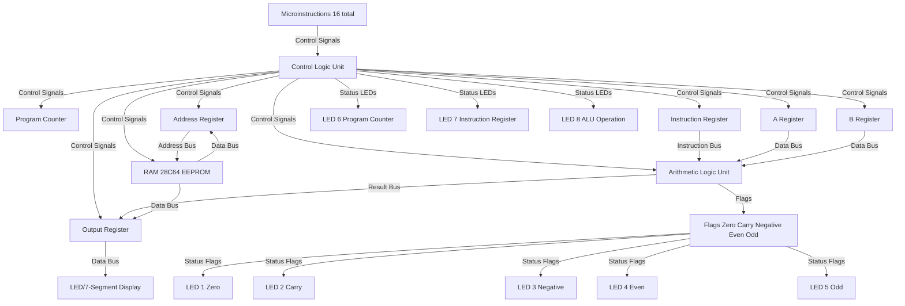

# Programmable 8-bit Computer on Breadboards


<p align="center">
    
</p>


This repository contains the code, schematics, and documentation for a programmable 8-bit computer built from scratch using simple logic gates on breadboards. The project is open source and fully scalable, capable of integrating additional functions and ICs.

# Project working



# EEPROM Programming Sequence 

```
graph TD
    Addr[Address Input] --> EEPROM[28C64 EEPROM Programmer]
    Data[Data Input] --> EEPROM
    Write[Write Control Signal] --> EEPROM
    EEPROM --> Verify[Data Verification]
```

## Project Overview

The computer is divided into several parts:

- PWM Clock
- Address Register
- RAM
- Instruction Register
- Control Logic
- Program Counter
- A Register
- B Register
- ALU (Arithmetic Logic Unit)
- Output Display
- Output Register
- Control Word
- Overflow, Underflow, Negative Flag Register

## Credits

This project is inspired by and credits Ben Eater for the original idea and guidance. While based on his concepts, this implementation includes updates and differences, enhancing functionality and scalability.

## Features

- **Scalability:** Easily expandable with additional functions and integrated circuits.
- **Custom Updates:** Includes enhancements and modifications beyond the original design.
- **Open Source:** Available for anyone to study, modify, and contribute to.

## Repository Structure

- `code/`: Contains the code for each component of the computer. [Code](https://github.com/Circuit-Overtime/8Bit-Computer-Programs/blob/1290e9e6d5b0815a8bc3304a0e4bb99490d9940c/8_Bit%20Computer%20Control%20Logic.ino)
- `eepromFlasher/`: Contains the code to flash OP Code into EEPROM for anyone following Ben Eaters Approach of Creating Control Logic. [eepromFlasher.ino]()
- `schematics/`: Includes schematics and diagrams detailing the computer's architecture.[Schematics](https://eater.net/8bit/schematics)
- `docs/`: Documentation, user manual, and design notes at [Dedicated Docs Dropping Soon](https://github.com/Circuit-Overtime/8Bit-Computer-Programs/blob/7d66061673cd8eb7509ea8b8da835e5c4654d911/Docs)

## Getting Started

1. Clone the repository to your local machine.
2. Refer to the documentation for assembly instructions, usage, and programming the computer.
3. Explore and contribute to the project as desired.


<div style="display: flex; justify-content: space-between; margin-bottom: 20px;">
    
    
      
</div>

##Changes

- Used Arduino Nano to drive control logic in place of ATC16 EEPROMS  [Code](https://github.com/Circuit-Overtime/8Bit-Computer-Programs/blob/1290e9e6d5b0815a8bc3304a0e4bb99490d9940c/8_Bit%20Computer%20Control%20Logic.ino)
- Added a negative flag register to the system [Specific Schematic will be Dropping Soon]
```c++
IF ALU_MSB == 1 and SUB = 1 THEN NEG_FLAG = 1
```

- Updated the Code to detect negative number and push a -ve sign at the output display mux ![Specific Code will be Dropping Soon]
```.c
#define NFLAG 11;
pinMode(NFLAG, INPUT);

if(NFLAG == 1)
{
  negativeFlgFunc();
}

```

- Updated the B register to be able to output contents to the BUS
- Updated the step counter to be able to count from (000)~2~ to (110)~2~
``` Now the Step Counter can Count Upto 7 Steps, the current repo code has only 5 Steps without NOP) ```
- Smoother Clock Speed with `20ms` delay from Arduino and `333Hz` PWM Clock.


# 8-Bit CPU Component List

## 1. **PWM Clock**
- **Purpose**: Generates the clock signal for the CPU.
- **Components**:
  - 555 Timer IC (for PWM signal generation)
  - Frequency Divider (optional)

## 2. **Address Register**
- **Purpose**: Holds the address of the memory location being accessed.
- **Components**:
  - 8-bit Latch (e.g., 74LS373 or equivalent)
  - Multiplexer (e.g., 74LS157)

## 3. **RAM (28C64 EEPROM)**
- **Purpose**: Stores program instructions and data.
- **Components**:
  - 28C64 EEPROM (for non-volatile storage)
  - 8-bit Address Bus
  - 8-bit Data Bus
  - Read/Write Control Signal

## 4. **Instruction Register**
- **Purpose**: Holds the current instruction fetched from memory.
- **Components**:
  - 8-bit Register (e.g., 74LS273)
  - Instruction Decoder

## 5. **Control Logic**
- **Purpose**: Decodes microinstructions and generates control signals for the CPU.
- **Components**:
  - Arduino Nano (programmed with microinstructions)
  - Control Logic Unit (based on microinstruction set)
  - LEDs (as signals for control)

## 6. **Program Counter**
- **Purpose**: Keeps track of the address of the next instruction to be fetched.
- **Components**:
  - 8-bit Register (e.g., 74LS161)
  - Address Bus
  - Control Signals (Increment/Load/Reset)

## 7. **A Register**
- **Purpose**: Holds one operand for arithmetic or logic operations.
- **Components**:
  - 8-bit Register (e.g., 74LS273)
  - Data Bus
  - ALU (Arithmetic Logic Unit)

## 8. **B Register**
- **Purpose**: Holds the second operand for arithmetic or logic operations.
- **Components**:
  - 8-bit Register (e.g., 74LS273)
  - Data Bus
  - ALU (Arithmetic Logic Unit)

## 9. **ALU (Arithmetic Logic Unit)**
- **Purpose**: Performs arithmetic and logic operations.
- **Components**:
  - 8-bit ALU (e.g., 74LS181)
  - Flag Registers for Zero, Carry, Negative, Even, Odd

## 10. **Output Display**
- **Purpose**: Displays the result of computations or program outputs.
- **Components**:
  - 7-Segment Display or LEDs
  - Output Register

## 11. **EEPROM Programmer**
- **Purpose**: Programs the 28C64 EEPROM with data.
- **Components**:
  - EEPROM Programmer Circuit
  - 28C64 EEPROM
  - Address Bus
  - Data Bus
  - Write Control Signal

---

## Miscellaneous Components
- **Resistors** (for current limiting and pull-up/down)
- **Capacitors** (for decoupling)
- **Breadboard** (for prototyping)
- **Jumper Wires** (for connections)
- **Power Supply** (e.g., 5V DC)
- **LEDs** (for status indicators)
- **Switches** (for input signals)


## Contributions

Contributions are welcome! If you have ideas, improvements, or bug fixes, feel free to open an issue or submit a pull request.

## License

This project is licensed under the [MIT License](LICENSE).
