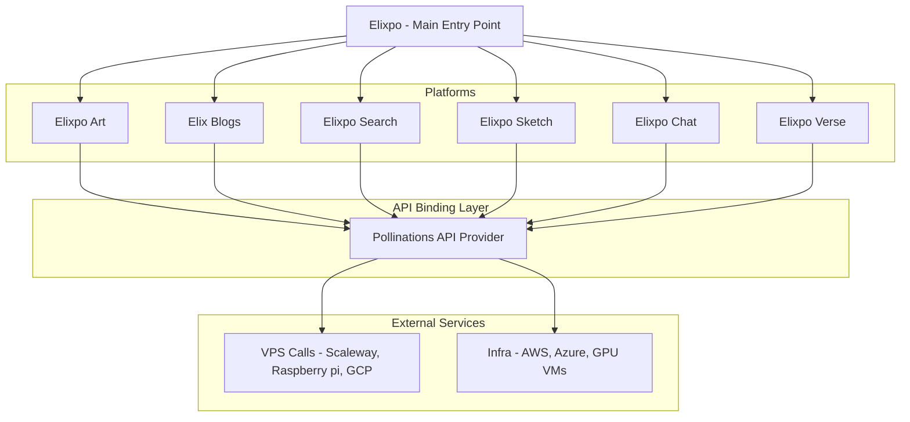

# [Elixpo-Chapter](https://elixpo.com) -- `A Dev Series`

### Elixpo is my personal college based project series targetted to build an open-source collaborative since 2023, my freshman years! It has been `2 Years` and counting and here's a short brief of the journey so far!
### 💖 **Welcome to the CHAPTER | Please leave a ⭐ on the repository (would mean a lot to me)**.

 
 
 
 
 
 
 
 

# 👑 Achievements of Elixpo Series:
- **Built `10+` Open Source Projects**
- **3000+ Stars on GitHub**
- **10+ Contributors**
- **20 Hackathons Participated**
- **Global Attention From Developers**
- **Made it to Pollinations + GSSOC + OSCI**
- **Hacktoberfest 2024 & 2025**
- **Funded by MS Startup Foundations 2024**

## 🚀 Key Features

- 🔓 **100% Open Source**
- 🆓 **_Free to use_**
- 🖼️ **Embed like any normal image or text**
- 🤖 **AI-Powered Art Generation**
- 🌐 **Web-Based Interface**
- 🤝 **Community-Driven Development**

> ### PS: This project is part of `Hacktoberfest 2025`. We welcome contributions from developers around the world to help us improve and expand the capabilities of this art generator.

## 📢 Latest News

- **Hacktoberfest 2025 is here!**  
  If you're participating, please check out our [Code of Conduct](./CODE_OF_CONDUCT.md) and [Contributing Guidelines](./CONTRIBUTING.md) before submitting your PRs.
- For event PRs, look for issues tagged with `hacktoberfest` in our [issue tracker](https://github.com/Circuit-Overtime/elixpo_ai_chapter/issues) and join the community effort!

# Elixpo Open Source Initiative

This project is a **college initiative** where I document and build all the large-scale projects and ideas I’ve been working on. The goal is to make them **open-source for public usage**, enabling collaboration, learning, and real-world contributions.  

Currently, the repository is licensed under **GNU GPL-3.0**, ensuring that all derived work also remains open-source.  
Through this initiative, I want to **give back to the community**, while creating a space for developers and learners to contribute, collaborate, and grow together.  

Since 2023, I’ve been deeply involved in development, and in the last two years, I’ve built **10+ open-source projects** that have collectively received **3000+ GitHub stars**.  

A special **shoutout** to [Ez-Vivek](https://github.com/ez-vivek) and [CSE-Anwesha](https://github.com/CSE-Anwesha) for being the **first contributors** to this project and helping lay the foundation for the initial codebase.  

### Projects in the Monorepo

- **Elixpo Art** – AI Art Generation and Enhancement Platform  
- **Elix Blogs** – Blogging Platform for Tech Articles  
- **Elixpo Search** – AI-Powered Search Engine  
- **Elixpo Chat** – AI Chatbot Platform  
- **Jackey** – Personalized Discord Bot  
- **Elixpo Sketch** – Real-time WYSIWYG Canvas + Editor  
- **Elixpo Verse** – A stylish wallpaper with an animated clock  
- **Inkflow** – Minimalist canvas, developed by [Ez-Vivek](https://github.com/ez-vivek)  
- **Fing** – Minimalist vibe-coding platform, developed by [Subhro Koley](https://github.com/IgYaHiko/Fing)  
- **Fing-UI** – React UI library, developed by [Subhro Koley](https://github.com/IgYaHiko/Fing)  
- **Text-Emoji** – Text-to-emoji converter using a fine-tuned T5-Small model  
- **Elixpo Portfolio** – My personal portfolio website  
- **Pollinations** – Improved UI for the flagship project website  

💡 Contributions are always welcome! Whether you’re into **AI, LLMs, Data Science, Web Development, or Cloud**, this initiative is a space to **learn, collaborate, and innovate in public**.

<a href="https://star-history.com/#Circuit-Overtime/elixpo_ai_chapter&Date">
  <picture>
    <source media="(prefers-color-scheme: dark)" srcset="https://api.star-history.com/svg?repos=Circuit-Overtime/elixpo_ai_chapter&type=Date&theme=dark" width="600" />
    <source media="(prefers-color-scheme: light)" srcset="https://api.star-history.com/svg?repos=Circuit-Overtime/elixpo_ai_chapter&type=Date" width="600" />
    
  </picture>
</a>

## Overall Architecture

## Development Note

Elixpo is a parallel development initiative with multiple sub-projects evolving simultaneously within this monorepo. We actively welcome external open-source projects—if you’d like your project featured here, submit a proposal! Accepted projects will be listed as contributors and included under the GNU GPL license.  

> Each project follows its own dedicated development track and process, covering diverse fields across computer science. This structure encourages collaboration, innovation, and cross-disciplinary growth within the Elixpo ecosystem.

## Collaborators

We are excited to collaborate with various developers and artists in the open-source community. If you are interested in contributing, please reach out! Together, we aim to enhance the capabilities of this art generator.

## Funding

This project is funded through a mix of personal investment, community contributions, and generous infrastructure support. Our cloud compute and VPS resources are provided by [Pollinations AI](https://pollinations.ai) — special thanks to Thomas Haferlach and the Pollinations team for enabling our large-scale AI workloads.

We are actively seeking sponsors to help us grow and sustain the project. If you or your organization would like to support Elixpo, please visit our [GitHub Sponsors page](https://github.com/sponsors/Circuit-Overtime) or reach out to discuss partnership opportunities.

Your support helps us cover infrastructure costs, accelerate development, and expand our open-source initiatives. Thank you for helping us build a more accessible and collaborative AI ecosystem!

#  Recent Releases

Here are some of our latest releases and live demos:

- **Elixpo Art Chrome Extension**  
  [Available on Chrome Web Store](https://chromewebstore.google.com/detail/elixpo-art-select-text-an/hcjdeknbbbllfllddkbacfgehddpnhdh?authuser=0&hl=en-GB&pli=1)  
  Easily generate AI art from selected text in your browser.

- **Elixpo Art Platform**  
  [elixpo.com](https://elixpo.com)  
  The main platform for AI-powered art generation and sharing.

- **Jackey Discord Bot**  
  [jackey.elixpo.com](https://jackey.elixpo.com)  
  A personalized Discord bot for image generation and more.

- **Fine-Tuned Llama Medicine Model**  
  [ollama.com/Elixpo/LlamaMedicine](https://ollama.com/Elixpo/LlamaMedicine)  
  Specialized Llama model fine-tuned for medicine-related tasks.

- **Emoji Translator**  
  [huggingface.co/Elixpo/Emoji-Contextual-Translator](https://huggingface.co/Elixpo/Emoji-Contextual-Translator)  
  Translate text to context-aware emojis using our custom model.

  - **Elixpo Art Blog**  
    [elixpo.com/blogs/elixpo_art](https://elixpo.com/blogs/elixpo_art)  
    In-depth articles and updates about the Elixpo Art platform.

---

# Our Vision

At Elixpo-ai-chapter, we are dedicated to shaping a future where AI is:

- **Open & Accessible**: AI should empower everyone—free from paywalls, proprietary barriers, or exclusivity.
- **Transparent & Ethical**: We prioritize transparency in our models and workflows, ensuring ethical development and responsible use.
- **Community-Driven**: Our platform thrives on collaboration, inviting developers, creators, and enthusiasts to contribute and innovate together.
- **Interconnected**: We’re building an ecosystem where AI tools and services integrate seamlessly, enabling composable and synergistic solutions.
- **Continuously Evolving**: We embrace rapid advancements in AI, adapting and improving while upholding our core values of openness and accessibility.

Our mission is to advance AI for the benefit of all—respecting ethical standards, fostering responsible innovation, and building a collaborative community. Join us in making AI open, ethical, and impactful for everyone.

# Stargazers

  

> ## `Made with ❤️ by Ayushman Bhattacharya & Collabs!`
