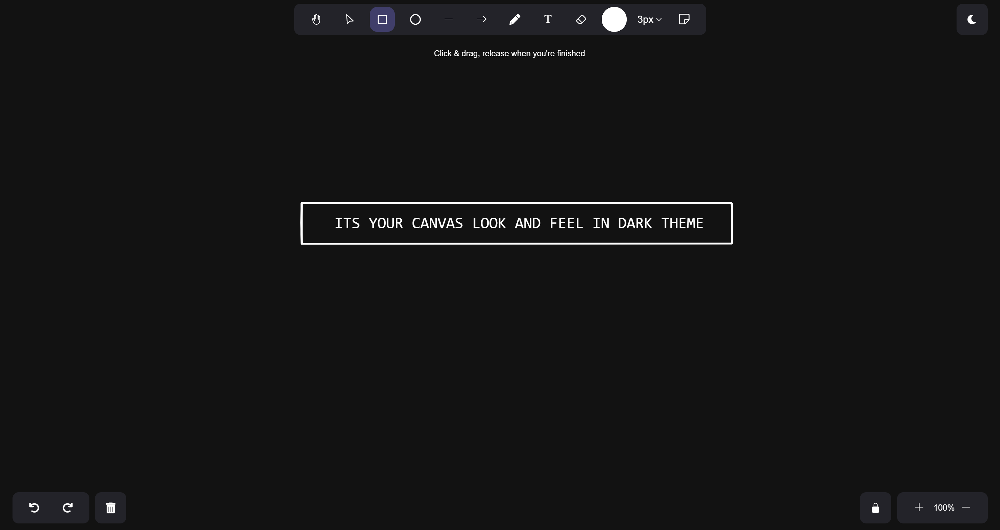

# ✨ Inkflow Workspace 🎨


## ✔️ Light Theme Preview 


## ✔️ Dark Theme Preview





---


Welcome to **Inkflow Workspace** – your go-to web app for seamless, intuitive digital art creation. Whether you’re sketching ideas, designing shapes, or exploring your creativity, Inkflow Workspace offers all the tools you need to bring your imagination to life!

---

## 🌟 Key Features

- ✏️ **Freehand Drawing**: Sketch smoothly and freely with our intuitive freehand drawing tool.
- 🔷 **Shape Tools**: Add basic shapes to structure your designs with just a click.
- 🎨 **Color & Brush Customization**: A rich palette of colors and adjustable brush sizes for perfect strokes.
- ↩️ **Undo & Redo**: Easily correct mistakes or revisit previous versions of your artwork.
- 💾 **Save & Export Options**: Save your work directly to your device or export it for sharing.

---

## 🛠️ Tech Stack

- 🖥️ **HTML** - Structural foundation of the app
- 🎨 **CSS** - Styling to make the app look clean and modern
- 💡 **JavaScript** - Adding dynamic interactions and functionality
- 🌈 **Tailwind CSS** - Rapid styling with utility-first approach
- 🖼️ **Iconscout** - Beautiful icons for UI elements
- 🚀 **Bootstrap Icons** - Sleek icons for intuitive navigation and layout

---

## 🚀 Getting Started

Here’s how to run **Inkflow Workspace** on your local machine:

1. **Clone the repository**:
   ```bash
   git clone https://github.com/ez-vivek/Inkflow.git
   ```

2. **Navigate to the project directory**:
   ```bash
   cd Inkflow
   ```

3. **Open the project** by launching `index.html` in your preferred browser.

---

## 🎉 Usage Instructions

1. **Launch Inkflow Workspace**: Open the app in your browser.
2. **Select Tools** 🛠️: Use the toolbar to select from drawing tools, shapes, colors, and brush sizes.
3. **Start Creating** 🖌️: Draw, add shapes, experiment with colors, and bring your ideas to life!
4. **Save Your Art** 💾: When ready, save or export your artwork to your device for future use or sharing.

---

## 🤝 Contributing

We’re excited to see the community help Inkflow Workspace grow! If you have ideas or want to make improvements, please open issues or submit pull requests. Let's make this app a creative haven for everyone! 

---

## 📜 License

This project is licensed under the MIT License. Check out the `LICENSE` file for more details.
