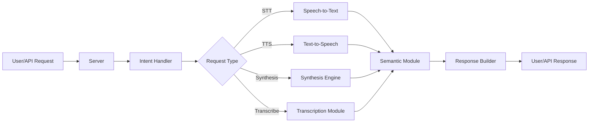

# Audio Pollinations

**Motto:**  
*Seamlessly bridging speech, semantics, and synthesis for creative audio intelligence.*

---

## Overview

Audio Pollinations is a modular Python framework for advanced audio processing, speech-to-text (STT), text-to-speech (TTS), and semantic audio understanding. It integrates state-of-the-art models and tools for building, serving, and experimenting with multimodal audio applications.

---

## Features

- **Speech Recognition (STT):** Accurate transcription of audio to text.
- **Speech Synthesis (TTS):** Natural-sounding voice generation from text.
- **Semantic Audio Processing:** Deep understanding and manipulation of audio content.
- **Modular Architecture:** Easily extend or swap components.
- **Server & API:** Ready-to-use server for deploying audio services.
- **Utilities & Tools:** Helpers for configuration, intent detection, and more.

---

## System Architecture



## Docker Structure

The project includes a Dockerfile for easy deployment and reproducibility. The Docker setup:

- **Base Image:** Uses `python:3.12-bullseye` for a stable Python environment.
- **System Dependencies:** Installs essential build tools and `ffmpeg` for audio processing.
- **Python Dependencies:** Installs all required Python packages from `requirements.txt`.
- **Source Code:** Copies the entire project into the container.
- **Entrypoint:** Exposes port 5000 and runs the main application (`src/app.py`) using Python.

This structure ensures a consistent environment for development, testing, and production, making it straightforward to run the application anywhere Docker is supported.

---
## API Endpoints

### `/audio` Endpoint

#### `GET /audio`

Generate audio from text using optional system prompt and voice.

**Query Parameters:**

- `text` (string, required): The text to synthesize.
- `system` (string, optional): System prompt for context.
- `voice` (string, optional): Voice selection (e.g., `alloy`, `ballad`, `verse`). Default is `alloy`.

**Example:**

```bash
curl -X GET "http://localhost:8000/audio?text=Transcribe%20this%3A&system=optional_system_prompt&voice=alloy"
```

#### `POST /audio`

Flexible endpoint for advanced audio synthesis, voice cloning, speech input, and transcription.

**Request Body (JSON):**

```json
{
    "messages": [
        {
            "role": "system",
            "content": [
                { "type": "text", "text": "System instructions here" }
            ]
        },
        {
            "role": "user",
            "content": [
                { "type": "text", "text": "Your prompt text here" },
                {
                    "type": "voice",
                    "voice": { 
                        "name": "alloy", // or "ballad", "verse", etc.
                        "data": "<base64_audio_string>", 
                        "format": "wav"
                    }
                },
                {
                    "type": "clone_audio_transcript",
                    "audio_text": "Transcription or description of the reference audio"
                },
                {
                    "type": "speech_audio",
                    "audio": { "data": "<base64_audio_string>", "format": "wav" }
                }
            ]
        }
    ]
}
```

- To perform **voice cloning**, include a `voice` object with base64-encoded WAV data.
- To provide **reference audio transcription**, use `clone_audio_transcript`.
- For **speech input**, use `speech_audio` with base64-encoded WAV data.

**Example:**

```bash
curl -X POST http://localhost:8000/audio \
    -H "Content-Type: application/json" \
    -d '{
        "messages": [
            {
                "role": "system",
                "content": [
                    { "type": "text", "text": "System instructions here" }
                ]
            },
            {
                "role": "user",
                "content": [
                    { "type": "text", "text": "Your prompt text here" },
                    {
                        "type": "voice",
                        "voice": {
                            "name": "alloy",
                            "data": "<base64_audio_string>",
                            "format": "wav"
                        }
                    },
                    {
                        "type": "clone_audio_transcript",
                        "audio_text": "Transcription or description of the reference audio"
                    },
                    {
                        "type": "speech_audio",
                        "audio": { "data": "<base64_audio_string>", "format": "wav" }
                    }
                ]
            }
        ]
    }' --output output.wav
```

**Response:**  
- Returns a WAV audio file or a JSON object, depending on the request and processing result.

**Modality Types:**
- **TTS:** Text-to-Speech (audio output)
- **STS:** Speech-to-Speech (audio output)
- **STT:** Speech-to-Text (text output)
- **TTT:** Text-to-Text (text output)

**Notes:**

- For voice cloning, include a `clone_audio` item with base64-encoded WAV audio.
- For speech input, include a `speech_audio` item with base64-encoded WAV audio.
- The response is a WAV audio file or a JSON object, depending on the request and processing result.

---

## License

Audio Pollinations is released under the GNU General Public License v3.0 (GPL-3.0). This license ensures that the project remains free and open-source, allowing anyone to use, modify, and distribute the software, provided that any derivative works are also distributed under the same license. For full details, see the [LICENSE](./LICENSE) file.

---

## Issues and Contributions

If you encounter bugs, have feature requests, or want to contribute improvements, please open an issue or submit a pull request via the [GitHub Issues](https://github.com/your-repo/audio.pollinations/issues) page. Contributions are welcome! Please follow the project's guidelines and code of conduct when participating.