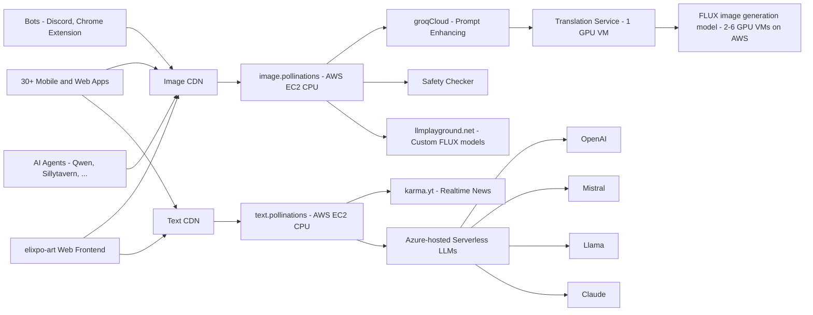

# [Elixpo-Chapter](https://elixpo.com) -- `A Dev Series`


## Elixpo is my personal college based project to build open-source projects since 2023, my freshman years! It has been `2 Years` and counting.

# Achievements of Elixpo Series:
- **Built `10+` Open Source Projects**
- **3000+ Stars on GitHub**
- **10+ Contributors**
- **20 Hackathons Participated**
- **Global Attention From Developers**
- **Made it to Pollinations + GSSOC + OSCI**
- **Hacktoberfest 2024 & 2025**


## 🚀 Key Features

- 🔓 **100% Open Source**
- 🆓 **_Free to use_**
- 🖼️ **Embed like any normal image or text**
- 🤖 **AI-Powered Art Generation**
- 🌐 **Web-Based Interface**
- 🤝 **Community-Driven Development**

> ### PS: This project is part of `Hacktoberfest 2025`. We welcome contributions from developers around the world to help us improve and expand the capabilities of this art generator.


## Project Overview
# Elixpo Open Source Initiative

This project is a **college initiative** where I document and build all the large-scale projects and ideas I’ve been working on. The goal is to make them **open-source for public usage**, enabling collaboration, learning, and real-world contributions.  

Currently, the repository is licensed under **GNU GPL-3.0**, ensuring that all derived work also remains open-source.  
Through this initiative, I want to **give back to the community**, while creating a space for developers and learners to contribute, collaborate, and grow together.  

Since 2023, I’ve been deeply involved in development, and in the last two years, I’ve built **10+ open-source projects** that have collectively received **3000+ GitHub stars**.  

A special **shoutout** to [Ez-Vivek](https://github.com/ez-vivek) and [CSE-Anwesha](https://github.com/CSE-Anwesha) for being the **first contributors** to this project and helping lay the foundation for the initial codebase.  


### Projects in the Monorepo

- **Elixpo Art** – AI Art Generation and Enhancement Platform  
- **Elix Blogs** – Blogging Platform for Tech Articles  
- **Elixpo Search** – AI-Powered Search Engine  
- **Elixpo Chat** – AI Chatbot Platform  
- **Jackey** – Personalized Discord Bot  
- **Elixpo Sketch** – Real-time WYSIWYG Canvas + Editor  
- **Elixpo Verse** – A stylish wallpaper with an animated clock  
- **Inkflow** – Minimalist canvas, developed by [Ez-Vivek](https://github.com/ez-vivek)  
- **Fing** – Minimalist vibe-coding platform, developed by [Subhro Koley](https://github.com/IgYaHiko/Fing)  
- **Fing-UI** – React UI library, developed by [Subhro Koley](https://github.com/IgYaHiko/Fing)  
- **Text-Emoji** – Text-to-emoji converter using a fine-tuned T5-Small model  
- **Elixpo Portfolio** – My personal portfolio website  
- **Pollinations** – Improved UI for the flagship project website  


💡 Contributions are always welcome! Whether you’re into **AI, LLMs, Data Science, Web Development, or Cloud**, this initiative is a space to **learn, collaborate, and innovate in public**.


<a href="https://star-history.com/#Circuit-Overtime/elixpo_ai_chapter&Date">
  <picture>
    <source media="(prefers-color-scheme: dark)" srcset="https://api.star-history.com/svg?repos=Circuit-Overtime/elixpo_ai_chapter&type=Date&theme=dark" width="600" />
    <source media="(prefers-color-scheme: light)" srcset="https://api.star-history.com/svg?repos=Circuit-Overtime/elixpo_ai_chapter&type=Date" width="600" />
    
  </picture>
</a>


## Architecture



## Development Note

The website is being built in a private repository, but updates are being made in the open-source version to keep track of changes and ensure security. This project is part of Hacktoberfest, and we welcome contributions from open-source developers.

Additionally, Kaggle builds are being created for the dataset to be published, and a model is being developed under specific circumstances. A Discord bot is also in development for the same purpose, alongside a Minecraft mod utilizing the Fabric API of version 1.21 to process requests and generate images in-game.

Research papers will be published, and efforts to fine-tune stickers and improve code readability are underway to make the repository more user-friendly.

## Collaborators

We are excited to collaborate with various developers and artists in the open-source community. If you are interested in contributing, please reach out! Together, we aim to enhance the capabilities of this art generator.

## Funding

This project is currently funded through a combination of personal investments and community contributions. We are exploring sponsorship opportunities to further expand the project's development and outreach. If you would like to support us or discuss potential funding options, please contact us.


## Gallery

You can explore the generated artwork in our [Gallery](https://elixpoart.vercel.app/src/gallery). 

We can include a query parameter `id` to help share specific images by their image ID. For example, you can access an image directly using the following link:

[https://elixpoart.vercel.app/src/gallery?id=9pde71i621](https://elixpoart.vercel.app/src/gallery?id=9pde71i621)

### Kaggle and Data Science Builds

We are planning to enhance our presence on Kaggle by creating and sharing various data science writings and scripts. These builds will focus on optimizing the dataset for our AI models and providing insights into data processing techniques. Our goal is to foster a community around data science practices and encourage collaboration on Kaggle.

- [15/10/2024]
- Code from Kaggle!
```bash
https://www.kaggle.com/code/circuitovertime/elixpo-ai-platform-testing-beta/edit/run/199734513
```
- Code from Google Colab!
```bash
https://colab.research.google.com/drive/1jfJKeganPiY2i2T-vR_TlPQuMKEq8SC_?usp=sharing
```
- A custom made prompt_collection for further research work
```bash
https://www.kaggle.com/datasets/circuitovertime/prompt-and-gibberish-for-ai-art-gen/data?select=prompts_collection.csv
```
- A custom made prompt pimper using `Elixpo/promptPimp` model of hugging-face
```bash
https://www.kaggle.com/code/overtimecraftsclips/fine-tuning-of-elixpo-promptpimp
```

- Added the kaggle research begind the backend of a low level model for prompt classification
- Added files under the /kaggle_workflows mentioning the ipnyb files of Kaggle and Google Colab!
- Added a custom dataset made especially for the low level model

### Chrome Extension
- A Custom Built Chrome Extension in Javascript which is approved by Google!
```bash
https://chromewebstore.google.com/detail/elixpo-art-select-text-an/hcjdeknbbbllfllddkbacfgehddpnhdh
```

### Discord Bot 
- A custom made discord bot for generating images using `discord.js` and `Discord API` implementation.
```bash
https://discord.com/oauth2/authorize?client_id=1214916249222643752
```

### Blogs Release 
- Released a detailed analysis blog for Elixpo_Art Service
```bash
  https://elixpoart.vercel.app/src/blogs/elixpo_art
```
### Minecraft Bots

In the future, we aim to expand the functionality  to, our Minecraft mod will be enhanced to support more complex interactions, allowing players to generate and manipulate images directly within the game. We envision these tools becoming integral parts of our ecosystem, enhancing user engagement and creativity.


## 🏢 Supported By

- [LLMPlayground.net](https://llmplayground.net/): Hosting Custom Flux Models
- [Karma.YT](https://karma.yt): Social media integrations
- [AWS Activate](https://aws.amazon.com/): GPU Cloud Credits
- [Google Cloud for Startups](https://cloud.google.com/): GPU Cloud Credits
- [OVH Cloud](https://www.ovhcloud.com/): GPU Cloud credits
- [NVIDIA Inception](https://www.nvidia.com/en-us/deep-learning-ai/startups/): AI startup support
- [Azure (MS for Startups)](https://azure.microsoft.com/): OpenAI credits
- [Outlier Ventures](https://outlierventures.io/): Startup Accelerator


## 🌍 Our Vision

Elixpo-ai-chapter envisions a future where AI technology is:

- **Open & Accessible**: We believe AI should be available to everyone, not locked behind paywalls or restricted access

- **Transparent & Ethical**: Our open-source approach ensures transparency in how our models work and behave

- **Community-Driven**: We're building a platform where developers, creators, and AI enthusiasts can collaborate and innovate

- **Interconnected**: We're creating an ecosystem where AI services can seamlessly work together, fostering innovation through composability

- **Evolving**: We embrace the rapid evolution of AI technology while maintaining our commitment to openness and accessibility

We're committed to developing AI technology that serves humanity while respecting ethical boundaries and promoting responsible innovation. Join us in shaping the future of AI.

### Stargazers

<p align="left">
  <a href="https://reporoster.com/stars/dark/Circuit-Overtime/elixpo_ai_chapter">
    
  </a>
</p>


## License

This is published under the `MIT LICENSE`.

---

Made with ❤️ by Ayushman Bhattacharya & Collabs!
