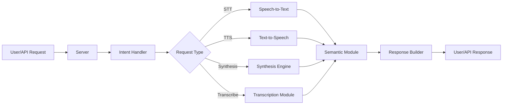

# Audio Pollinations

**Motto:**  
*Seamlessly bridging speech, semantics, and synthesis for creative audio intelligence.*

---

## Overview

Audio Pollinations is a modular Python framework for advanced audio processing, speech-to-text (STT), text-to-speech (TTS), and semantic audio understanding. It integrates state-of-the-art models and tools for building, serving, and experimenting with multimodal audio applications.

---

## Features

- **Speech Recognition (STT):** Accurate transcription of audio to text.
- **Speech Synthesis (TTS):** Natural-sounding voice generation from text.
- **Semantic Audio Processing:** Deep understanding and manipulation of audio content.
- **Modular Architecture:** Easily extend or swap components.
- **Server & API:** Ready-to-use server for deploying audio services.
- **Utilities & Tools:** Helpers for configuration, intent detection, and more.

---

## System Architecture

## Docker Structure

The project includes a Dockerfile for easy deployment and reproducibility. The Docker setup:

- **Base Image:** Uses `python:3.12-bullseye` for a stable Python environment.
- **System Dependencies:** Installs essential build tools and `ffmpeg` for audio processing.
- **Python Dependencies:** Installs all required Python packages from `requirements.txt`.
- **Source Code:** Copies the entire project into the container.
- **Entrypoint:** Exposes port 5000 and runs the main application (`src/app.py`) using Python.

This structure ensures a consistent environment for development, testing, and production, making it straightforward to run the application anywhere Docker is supported.

---

## License

Audio Pollinations is released under the GNU General Public License v3.0 (GPL-3.0). This license ensures that the project remains free and open-source, allowing anyone to use, modify, and distribute the software, provided that any derivative works are also distributed under the same license. For full details, see the [LICENSE](./LICENSE) file.

---

## Issues and Contributions

If you encounter bugs, have feature requests, or want to contribute improvements, please open an issue or submit a pull request via the [GitHub Issues](https://github.com/your-repo/audio.pollinations/issues) page. Contributions are welcome! Please follow the project's guidelines and code of conduct when participating.