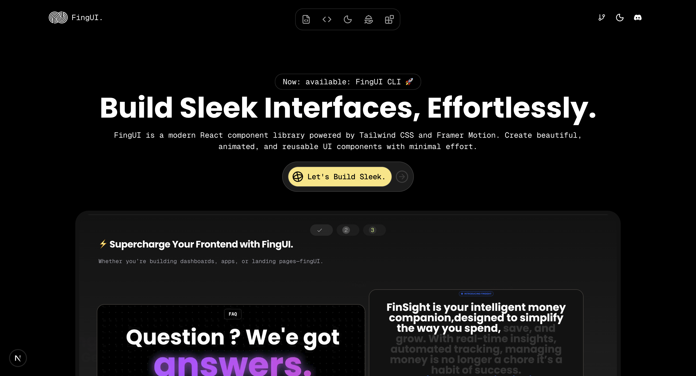
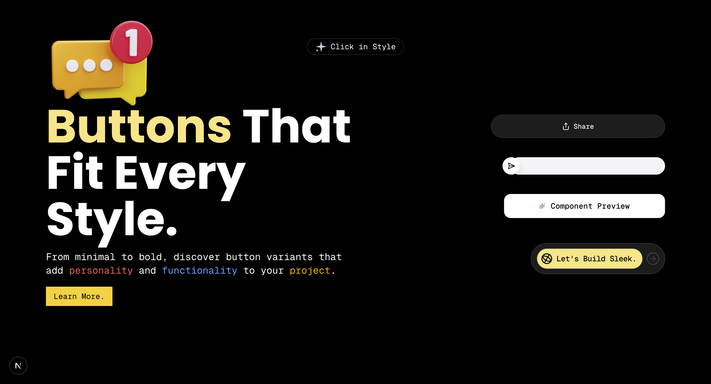
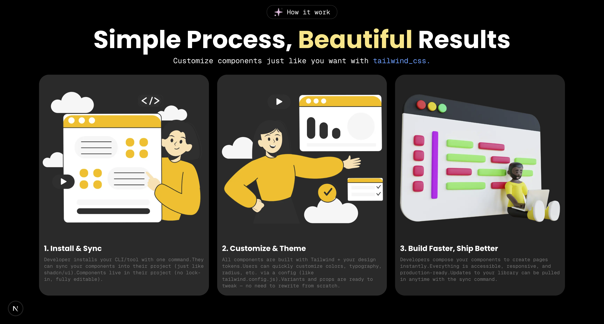

# FingUI 🚀  
FingUI is a modern UI component library built with **React**, **Tailwind CSS v4**, and **Framer Motion**.  
It provides beautiful, reusable, and production-ready components to help developers ship faster without compromising on design.  

 <!-- Image 1 -->

---
## ⚡️ Preview
 <!-- Image 2 -->

---
## ✨ Features
- 🎨 **Customizable Components** – Tailored with props and theme support.  
- ⚡ **Performance Optimized** – Lightweight with zero bloat.  
- 🔥 **Framer Motion Powered** – Smooth, production-ready animations.  
- 🛠️ **Developer Friendly** – Simple APIs, reusable across projects.  
- 🌍 **Cross-Platform Ready** – Works seamlessly with React + React Native.  
## ⚡️ Glimps
 <!-- Image 2 -->
---

## 🧑‍💻 Tech Stack
- **React** – Frontend foundation  
- **Tailwind CSS** – For sleek styling  
- **Framer Motion** – For fluid animations  
- **TypeScript** – Strict type safety  
- **Rollup** – For bundling & packaging  


## 💻 WorkFlow
 <!-- Image 2 -->

---

## 🚀 Getting Started  

Before installing FingUI, make sure you have the following installed on your system:  

### ✅ Node.js & npm  
- Download & install from [nodejs.org](https://nodejs.org/)  
- Verify installation:  
  ```bash
  node -v
  npm -v
