# Elixpo Search Agent


A Python-based web search and synthesis API that processes user queries, performs web and YouTube searches, scrapes content, and generates detailed Markdown answers with sources and images. Built for extensibility, robust error handling, and efficient information retrieval using modern async APIs and concurrency.

**NEW: Now features an IPC-based embedding model server for optimized GPU resource usage and better scalability!**

---

## Architecture Overview

The system now uses an Inter-Process Communication (IPC) architecture to optimize GPU resource usage and enable horizontal scaling:

```mermaid
graph TB
    subgraph "Client Layer"
        A1[App Worker 1<br/>Port: 5000]
        A2[App Worker 2<br/>Port: 5001]  
        A3[App Worker N<br/>Port: 500X]
    end
    
    subgraph "IPC Communication Layer"
        IPC[IPC Manager<br/>BaseManager]
    end
    
    subgraph "Model Server Layer"
        ES[Embedding Server<br/>Port: 5002<br/>🔥 GPU Optimized]
    end
    
    subgraph "Embedding Services"
        ES --> EM[SentenceTransformer<br/>all-MiniLM-L6-v2]
        ES --> VI[Vector Index<br/>FAISS]
        ES --> WS[Web Search<br/>+ Embeddings]
    end
    
    subgraph "External Services"
        YS[Yahoo Search API]
        WEB[Web Scraping]
        YT[YouTube Transcripts]
        LLM[Pollinations LLM API]
    end
    
    A1 -.->|TCP:5002| IPC
    A2 -.->|TCP:5002| IPC
    A3 -.->|TCP:5002| IPC
    IPC <-->|authkey| ES
    
    A1 --> YS
    A2 --> YS
    A3 --> YS
    
    A1 --> WEB
    A2 --> WEB
    A3 --> WEB
    
    A1 --> YT
    A2 --> YT
    A3 --> YT
    
    A1 --> LLM
    A2 --> LLM
    A3 --> LLM
    
    ES --> WEB
    
    classDef serverNode fill:#e1f5fe,stroke:#01579b,stroke-width:2px
    classDef workerNode fill:#f3e5f5,stroke:#4a148c,stroke-width:2px
    classDef modelNode fill:#fff3e0,stroke:#e65100,stroke-width:3px
    classDef externalNode fill:#e8f5e8,stroke:#2e7d32,stroke-width:2px
    
    class ES,EM,VI,WS modelNode
    class A1,A2,A3 workerNode
    class IPC serverNode
    class YS,WEB,YT,LLM externalNode
```



### Key Benefits of IPC Architecture:

1. **🎯 Single GPU Instance**: Only one embedding model loads on GPU, reducing memory usage
2. **⚡ Concurrent Processing**: Multiple app workers can use embeddings simultaneously
3. **🔄 Load Balancing**: Requests are queued and processed efficiently
4. **💰 Cost Optimization**: Significantly reduced GPU memory requirements
5. **📈 Horizontal Scaling**: Easy to add more app workers without additional GPU load
6. **🛡️ Fault Isolation**: Embedding server failures don't crash app workers
7. **🔧 Hot Reloading**: Can restart app workers without reloading heavy embedding model

---

## Features

### 1. **Advanced Search & Synthesis**
- Accepts user queries and processes them using web search, YouTube transcript analysis, and AI-powered synthesis.
- Produces comprehensive Markdown responses with inline citations and images.
- Handles complex, multi-step queries with iterative tool use.

### 2. **Web Search & Scraping**
- Scrapes main text and images from selected URLs (after evaluating snippets).
- Avoids scraping irrelevant or search result pages.

### 3. **YouTube Integration**
- Extracts metadata and transcripts from YouTube videos.
- Presents transcripts as clean, readable text.

### 4. **AI-Powered Reasoning**
- Uses Pollinations API for LLM-based planning and synthesis.
- Iteratively calls tools (web search, scraping, YouTube, timezone) as needed.
- Gathers evidence from multiple sources before answering.

### 5. **REST API (Quart)**
- Exposes `/search` (JSON) and `/search/sse` (Server-Sent Events) endpoints.
- Supports both GET and POST requests, including OpenAI-compatible message format.
- CORS enabled for web front-ends.

### 6. **Concurrency & Performance**
- Uses async and thread pools for parallel web scraping and YouTube processing.
- Handles multiple requests efficiently.

---

## File Structure

- **`app.py`**  
  Main Quart API server. Handles `/search`, `/search/sse`, and OpenAI-compatible `/v1/chat/completions` endpoints. Manages async event streams and JSON responses.

- **`searchPipeline.py`**  
  Core pipeline logic. Orchestrates tool calls (web search, scraping, YouTube, timezone), interacts with Pollinations LLM API, and formats Markdown answers with sources and images.

### 🆕 IPC Embedding System:
- **`modelServer.py`**  
  The new IPC-based embedding server that runs on port 5002. Handles SentenceTransformer model, FAISS indexing, and web search with embeddings.

- **`embeddingClient.py`**  
  Client module for connecting to the embedding server. Provides thread-safe access with automatic reconnection.

- **`textEmbedModel.py`**  
  Updated legacy module with backward compatibility. Automatically switches between IPC and local models based on configuration.

- **`start_embedding_server.py`**  
  Startup script for launching the embedding server with proper monitoring and graceful shutdown.

- **`test_embedding_ipc.py`**  
  Test suite for validating IPC connection and embedding functionality.

### Other modules:  
- `clean_query.py`, `search.py`, `scrape.py`, `getYoutubeDetails.py`, `tools.py`, `getTimeZone.py`: Tool implementations for query cleaning, web search, scraping, YouTube, and timezone handling.
- `.env`: Environment variables for API tokens and model config.
- `requirements.txt`: Python dependencies.
- `Dockerfile`, `docker-compose.yml`: Containerization and deployment.

---

## Usage

### Prerequisites

- Python 3.12
- Install dependencies:
  ```bash
  pip install -r requirements.txt
  ```
- Set up `.env` with required API tokens.

### 🚀 Running with IPC Embedding Server (Recommended)

#### 1. Start the Embedding Server
```bash
# Terminal 1: Start the embedding server
cd search/PRODUCTION
python start_embedding_server.py
```

The embedding server will start on port 5002 and load the SentenceTransformer model onto available GPU.

#### 2. Test the IPC Connection
```bash
# Terminal 2: Test the embedding server
python test_embedding_ipc.py
```

#### 3. Start App Workers
```bash
# Terminal 3: Start first app worker
cd src
python app.py

# Terminal 4: Start additional workers on different ports
PORT=5001 python app.py
PORT=5002 python app.py
```

### 📊 Monitoring

- **Embedding Server**: Monitor GPU usage and active operations through logs
- **App Workers**: Each worker connects independently to the embedding server
- **Health Check**: Use the test script to verify IPC connectivity

### 🔧 Configuration

Set environment variables:
```bash
# Enable/disable IPC embedding (default: true)
export USE_IPC_EMBEDDING=true

# Embedding server configuration
export EMBEDDING_SERVER_HOST=localhost
export EMBEDDING_SERVER_PORT=5002
```

### 🔄 Fallback Mode

If the embedding server is unavailable, the system automatically falls back to local embedding models, ensuring service continuity.

### Running Locally (Legacy Mode)

```bash
# Disable IPC and use local models
export USE_IPC_EMBEDDING=false
python app.py
```
- API available at `http://127.0.0.1:5000/search`

### Example API Queries

#### Simple POST (JSON)
```bash
curl -X POST http://localhost:5000/search \
  -H "Content-Type: application/json" \
  -d '{"query": "What are the latest trends in AI research? Summarize this YouTube video https://www.youtube.com/watch?v=dQw4w9WgXcQ"}'
```

#### OpenAI-Compatible POST
```bash
curl -X POST http://localhost:5000/search \
  -H "Content-Type: application/json" \
  -d '{
    "messages": [
      {"role": "user", "content": "Tell me about the history of the internet."}
    ]
  }'
```

#### SSE Streaming
```bash
curl -N -X POST http://localhost:5000/search/sse \
  -H "Content-Type: application/json" \
  -d '{"query": "weather in London tomorrow"}'
```

---

## API Endpoints

- **`/search`**  
  - `POST`/`GET`  
  - Accepts `{"query": "..."}`
  - Also supports OpenAI-style `{"messages": [...]}`

- **`/search/sse`**  
  - `POST`  
  - Streams results as Server-Sent Events (SSE)

- **`/v1/chat/completions`**  
  - OpenAI-compatible chat completions endpoint

---

## Configuration

### Environment Variables

Set environment variables in `.env`:
```bash
# Pollinations API
TOKEN=your_pollinations_token
MODEL=your_model_name
REFERRER=your_referrer

# IPC Embedding Configuration
USE_IPC_EMBEDDING=true
EMBEDDING_SERVER_HOST=localhost
EMBEDDING_SERVER_PORT=5002

# Worker Configuration  
PORT=5000
MAX_CONCURRENT_OPERATIONS=3
```

### Scaling Configuration

- **Embedding Server**: Adjust `MAX_CONCURRENT_OPERATIONS` in `modelServer.py`
- **App Workers**: Set different `PORT` values for multiple workers
- **Memory Management**: Configure batch sizes and GPU memory fractions as needed

---

## Performance Optimizations

### GPU Memory Management
- Single embedding model instance shared across all workers
- Automatic GPU memory cleanup after operations
- Configurable batch sizes for large document processing

### Concurrency Controls
- Semaphore-based operation limiting
- Thread-safe GPU operations
- Automatic retry logic with exponential backoff

### Caching & Efficiency
- LRU cache for frequently accessed embeddings
- Connection pooling for web requests
- Async processing for I/O operations

---

## API Endpoints

- **`/search`**  
  - `POST`/`GET`  
  - Accepts `{"query": "..."}`
  - Also supports OpenAI-style `{"messages": [...]}`

- **`/search/sse`**  
  - `POST`  
  - Streams results as Server-Sent Events (SSE)

- **`/v1/chat/completions`**  
  - OpenAI-compatible chat completions endpoint

### Health Check Endpoints
- **`/health`** - App worker health status
- **`/embedding/health`** - Embedding server connectivity status
- **`/embedding/stats`** - Active operations and performance metrics

---

## Deployment

### Docker Deployment
```bash
# Build and run with docker-compose
docker-compose up --build

# Scale app workers
docker-compose up --scale search-app=3
```

### Kubernetes Deployment
```yaml
# Example scaling configuration
apiVersion: apps/v1
kind: Deployment
metadata:
  name: search-embedding-server
spec:
  replicas: 1  # Single embedding server
  selector:
    matchLabels:
      app: embedding-server
---
apiVersion: apps/v1  
kind: Deployment
metadata:
  name: search-app-workers
spec:
  replicas: 5  # Multiple app workers
  selector:
    matchLabels:
      app: search-app
```

---

## Troubleshooting

### Common Issues

1. **Embedding Server Connection Failed**
   ```bash
   # Check if server is running
   netstat -tulpn | grep 5002
   
   # Test connection
   python test_embedding_ipc.py
   ```

2. **GPU Out of Memory**
   ```bash
   # Reduce batch size in modelServer.py
   # Lower MAX_CONCURRENT_OPERATIONS
   # Check GPU memory: nvidia-smi
   ```

3. **High Latency**
   ```bash
   # Monitor active operations
   # Scale up app workers if needed
   # Check network latency between workers and embedding server
   ```

### Logs and Monitoring
- Embedding server logs: Check `modelServer.py` output
- App worker logs: Check individual `app.py` instances  
- System metrics: Monitor GPU usage, memory, and CPU
- Connection health: Use test scripts regularly

---

## Migration Guide

### From Legacy to IPC System

1. **Backup Current Setup**
2. **Install New Dependencies**: `pip install loguru`
3. **Start Embedding Server**: `python start_embedding_server.py`
4. **Test Connection**: `python test_embedding_ipc.py`
5. **Update Environment**: Set `USE_IPC_EMBEDDING=true`
6. **Restart App Workers**: They will automatically use IPC
7. **Monitor Performance**: Check logs and resource usage

### Rollback Plan
Set `USE_IPC_EMBEDDING=false` to return to local embedding models.

---

## Quick Start 🚀

### Option 1: Automated Service Manager (Recommended)

#### Linux/macOS:
```bash
cd search/PRODUCTION
python service_manager.py --workers 3 --port 5000
```

#### Windows:
```powershell
cd search/PRODUCTION
.\start_services.ps1 -Workers 3 -BasePort 5000
```

### Option 2: Manual Setup

1. **Start Embedding Server**:
   ```bash
   cd search/PRODUCTION
   python start_embedding_server.py
   ```

2. **Test Connection**:
   ```bash
   python test_embedding_ipc.py
   ```

3. **Start App Workers**:
   ```bash
   cd src
   PORT=5000 python app.py &
   PORT=5001 python app.py &
   PORT=5002 python app.py &
   ```

### Access Points
- **Search API**: `http://localhost:5000/search`
- **Health Check**: `http://localhost:5000/health`
- **Embedding Health**: `http://localhost:5000/embedding/health`
- **Embedding Stats**: `http://localhost:5000/embedding/stats`

---

## Limitations

- Relies on Pollinations API for LLM responses (subject to their rate limits).
- Requires internet connectivity for search and scraping.
- YouTube transcript extraction depends on third-party services.
- **NEW**: Embedding server requires sufficient GPU memory for optimal performance.

---
